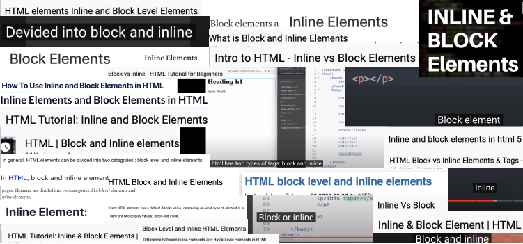
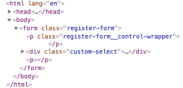
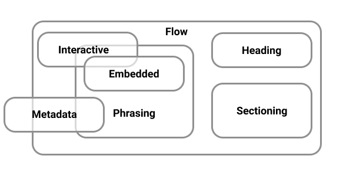
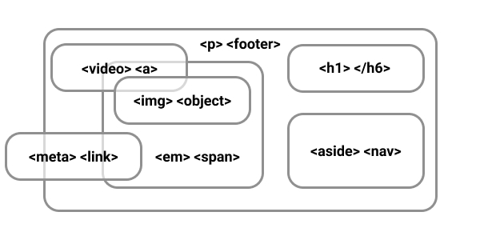
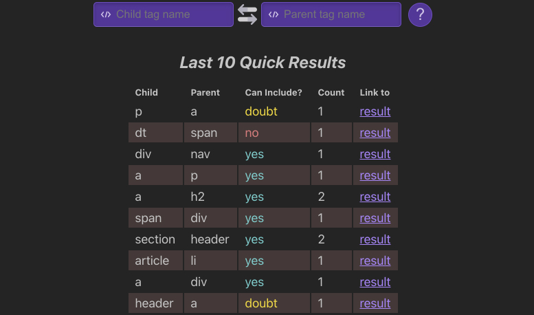

# Block or inl`<i>`ne ?

<p align="center">
  
</p>

This image contains about 50 screenshots from random articles and courses, where the authors state that tags in HTML are divided into two types - block and inline.

**It is wrong.**

HTML tags are divided into **7** types. In this article, we will learn about them and how to use them correctly.

Program for today:
- The Problem
- 7 types of HTML Element
- Let's play. Can `<x>` be nested in `<y>`?
- Can I Include
- Conclusions

## The Problem

Let's imagine that we have a task where we need to make the markup of the form. Something like this:

```jsx
// src/components/sign-up/components/register-form/register-form.jsx

<form className="register-form">
  <p className="register-form__control-wrapper">
    <CustomSelect label="Type:" options={[]} />
  </p>
<form>
```

<details>
  <summary>CustomSelect markup</summary>

  ```jsx
    // src/components/common/custom-select/custom-select.jsx

    const CustomSelect = ({ label, options }) => (
      <div className="custom-select">
        <label className="custom-select__label">
          {label}
          <select className="custom-select__control">
            {options.map((it) => (
              <option value={it.value}>{it.label}</option>
            ))}
          </select>
        </label>
      </div>
    );
  ```
</details>

But when we open the browser we see this:

<p align="center">
  
</p>

Hmm, the custom select component outside of `p` element? An extra `p` appeared? What is going on...

This is how the browser behaves when we try to nest one element incorrectly within another.

**This is not because we are trying to nest a block element within a block element!**

## 7 types of HTML Element

According to the [documentation](https://html.spec.whatwg.org/multipage/dom.html#kinds-of-content):

> Each element in HTML falls into zero or more categories that group elements with similar characteristics together.

HTML Element content types:

- [Metadata content](https://html.spec.whatwg.org/multipage/dom.html#metadata-content-2)  — information for browsers, search engines and etc. (everything in the `<head>`);
- [Flow content](https://html.spec.whatwg.org/multipage/dom.html#flow-content-2) — content (everything in the `<body>`);
- [Phrasing content](https://html.spec.whatwg.org/multipage/dom.html#phrasing-content-2) — document text and small text elements in paragraphs;
- [Sectioning content](https://html.spec.whatwg.org/multipage/dom.html#sectioning-content-2) — semantic sections of the document;
- [Heading content](https://html.spec.whatwg.org/multipage/dom.html#heading-content-2) — headlines;
- [Embedded content](https://html.spec.whatwg.org/multipage/dom.html#embedded-content-category) — images, video, audio and etc;
- [Interactive content](https://html.spec.whatwg.org/multipage/dom.html#interactive-content-2) — what the user is interacting with.

<p align="center">
  
  <br>
  <span>HTML Element content types</span>
</p>

<p align="center">
  
  <br>
  <span>HTML Element content types with tags</span>
</p>

*When you try to nest one tag in another incorrectly, browser, **without asking**, starts fixing errors **at its discretion***

## Let's play. Can `<x>` be nested in `<y>`?

Open the [documentation](https://html.spec.whatwg.org/multipage/semantics.html#semantics) and try to find the answer yourself 😉

```html
<li>
  <p>?</p>
</li>
```

<details>
  <summary>Spoiler</summary>

  **Yes, you can!**

  [The `li` element](https://html.spec.whatwg.org/multipage/grouping-content.html#the-li-element) content model — `flow content`.

  [The `p` element](https://html.spec.whatwg.org/multipage/grouping-content.html#the-p-element) categories — `flow content`, `palpable content`.

</details>

```html
<header>
  <section>?</section>
</header>
```

<details>
  <summary>Spoiler</summary>

  **Yes, you can!**

  [The `header` element](https://html.spec.whatwg.org/multipage/sections.html#the-header-element) content model — `flow content`, but with no `header` or `footer` element descendants.

  [The `section` element](https://html.spec.whatwg.org/multipage/sections.html#the-section-element) categories — `flow content`, `sectioning content`, `palpable content`.

</details>

```html
<p>
  <div>?</div>
</p>
```

<details>
  <summary>Spoiler</summary>

  **No, you can't!**

  [The `p` element](https://html.spec.whatwg.org/multipage/grouping-content.html#the-p-element) content model — `phrasing content`.

  [The `div` element](https://html.spec.whatwg.org/multipage/grouping-content.html#the-div-element) categories — `flow content`, `palpable content`.

</details>


<small>Ps. after this example, you should understand why the markup broke in our task above 🙂 </small>
## Can I Include

Of course you shouldn't memorize all types of content, but sometimes you should look there when you are not sure or something is broken.

By the analogue [Can I Use](https://caniuse.com/), the [Can I Include](https://caninclude.glitch.me/) tool has been developed that can help us with this.

<p align="center">
  
</p>

## Conclusions

The main thing you have to remember is that *there are **no** block or inline elements in HTML*. There are **7** types of content that expect a certain nesting into each other.


You *don't need to memorize them all*, but sometimes when you have doubts, or something is broken, you can look at the [documentation](https://html.spec.whatwg.org/multipage/dom.html#kinds-of-content) or use this [excellent tool](https://caninclude.glitch.me/) to check yourself.

When we learn a new foreign language, sometimes we look into the dictionary to check something. The same happens with any other language (markup, programming and etc.) — sometimes you need to look into the dictionary (documentation) to understand why it works this way.
