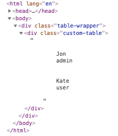
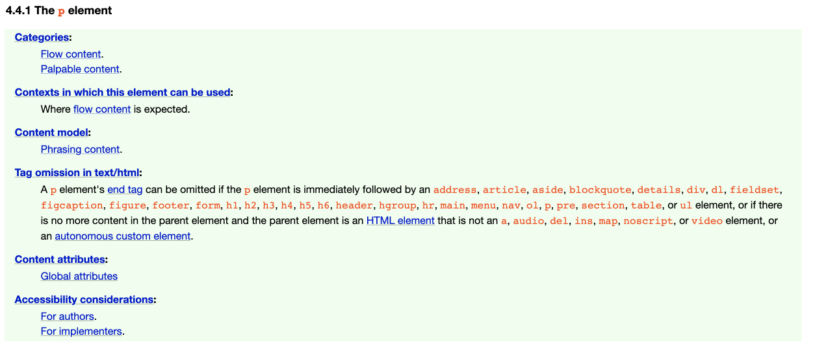

# Block or inl`<i>`ne ?

<p align="center">
  
</p>

This image contains around 50 screenshots from random articles and courses, where the authors state that tags in HTML are divided into two types — block and inline.

**This is wrong.**

HTML tags are divided into **7** types. In this article we will learn about them and how to use them correctly.

## The Problem

Let's imagine that we have a task where we need to make a markup of a form. Something like this:

```jsx
// src/components/sign-up/components/register-form/register-form.jsx

<form className="register-form">
  <p className="register-form__control-wrapper">
    <CustomSelect label="Type:" options={[]} />
  </p>
</form>
```

<details>
  <summary>CustomSelect markup</summary>

  ```jsx
    // src/components/common/custom-select/custom-select.jsx

    const CustomSelect = ({ label, options }) => (
      <div className="custom-select">
        <label className="custom-select__label">
          {label}
          <select className="custom-select__control">
            {options.map((it) => (
              <option value={it.value}>{it.label}</option>
            ))}
          </select>
        </label>
      </div>
    );
  ```
</details>

But when we open the browser we see this:

<p align="center">
  
</p>

Hmm, the custom select component outside of the `p` element? An extra `p` appeared?

One more example:

```jsx
// src/components/sign-up/components/users/users.jsx

<div className="table-wrapper">
  <CustomTable>
    {users.map((user) => (
      <tr>
        <td>{user.name}</td>
        <td>{user.role}</td>
      </tr>
    ))}
  </CustomTable>
</div>
```

<details>
  <summary>CustomTable markup</summary>

  ```jsx
    // src/components/common/custom-table/custom-table.jsx

    const CustomTable = ({ children }) => (
      <table className="custom-table">
        {children}
      </table>
    );
  ```
</details>

Let's open a browser:

<p align="center">
  
</p>

What is going on...

This is how the browser behaves when we try to nest one element incorrectly within another.

## 7 types of HTML Element

Each element in HTML falls into zero or more categories that group elements with similar characteristics together, has its own content model and other nuances and features. For example [the p element](https://html.spec.whatwg.org/multipage/grouping-content.html#the-p-element):

<p align="center">
  
</p>

HTML Element content types:

- [Metadata content](https://html.spec.whatwg.org/multipage/dom.html#metadata-content-2)  — information for browsers, search engines and etc. (everything in the `<head>`);
- [Flow content](https://html.spec.whatwg.org/multipage/dom.html#flow-content-2) — content (everything in the `<body>`);
- [Phrasing content](https://html.spec.whatwg.org/multipage/dom.html#phrasing-content-2) — document text and small text elements in paragraphs;
- [Sectioning content](https://html.spec.whatwg.org/multipage/dom.html#sectioning-content-2) — semantic sections of the document;
- [Heading content](https://html.spec.whatwg.org/multipage/dom.html#heading-content-2) — headlines;
- [Embedded content](https://html.spec.whatwg.org/multipage/dom.html#embedded-content-category) — images, video, audio and etc;
- [Interactive content](https://html.spec.whatwg.org/multipage/dom.html#interactive-content-2) — what the user is interacting with.

<p align="center">
  
  <br>
  <span>HTML Element content types</span>
</p>

<p align="center">
  
  <br>
  <span>HTML Element content types with some tags</span>
</p>

*When you try to nest one tag in another incorrectly, browser starts fixing errors **at its discretion without asking**.*

## Let's play. Can `<x>` be nested in `<y>`?

Open the [documentation](https://html.spec.whatwg.org/multipage/semantics.html#semantics) and try to find the answer yourself 😉

```html
<li>
  <p>?</p>
</li>
```

<details>
  <summary>Spoiler</summary>

  **Yes, you can!**

  [The `li` element](https://html.spec.whatwg.org/multipage/grouping-content.html#the-li-element) content model — `flow content`.

  [The `p` element](https://html.spec.whatwg.org/multipage/grouping-content.html#the-p-element) categories — `flow content`, `palpable content`.

</details>

```html
<header>
  <section>?</section>
</header>
```

<details>
  <summary>Spoiler</summary>

  **Yes, you can!**

  [The `header` element](https://html.spec.whatwg.org/multipage/sections.html#the-header-element) content model — `flow content`, but with no `header` or `footer` element descendants.

  [The `section` element](https://html.spec.whatwg.org/multipage/sections.html#the-section-element) categories — `flow content`, `sectioning content`, `palpable content`.

</details>

```html
<p>
  <div>?</div>
</p>
```

<details>
  <summary>Spoiler</summary>

  **No, you can't!**

  [The `p` element](https://html.spec.whatwg.org/multipage/grouping-content.html#the-p-element) content model — `phrasing content`.

  [The `div` element](https://html.spec.whatwg.org/multipage/grouping-content.html#the-div-element) categories — `flow content`, `palpable content`.

</details>

How can we test ourselves and our application? One of the tools is the official [W3C validator](https://validator.w3.org/).

You can upload the file, paste the code, or use the link to your application.

Let's try using one of our examples at the beginning of the article:

<p align="center">
  
</p>

The result:

<p align="center">
  
</p>

The validator and the browser did not know what we meant when we nested the `<tr>` element inside the `<div>` element. The browser tried to fix the errors itself (because of this, we got the wrong markup), and the validator talks about the stray start `<td>` tag in the markup. Which is not strange, since according to the [documentation](https://html.spec.whatwg.org/multipage/tables.html#the-tr-element), the `<tr>` element can only be used inside the table tags (`<thead>`, `<tbody>`, `<tfoot>`, `<table>`).

## Can I Include

Of course you don’t have to memorize all types of content but sometimes you should look there when you are not sure or something is broken.

By analogy with [Can I Use](https://caniuse.com/), the [Can I Include](https://caninclude.glitch.me/) tool has been developed that can help us with this.

<p align="center">
  
</p>

## Conclusions

Each HTML element has its own category and its own type of content that it can have. In general, there are **7** types of content that expect a certain nesting into each other.

You *don't have to memorize them all* but sometimes when you have doubts or something is broken you can look at the [documentation](https://html.spec.whatwg.org/multipage/dom.html#kinds-of-content), check your code in the HTML [validator](https://validator.w3.org/) or use the [CanIUse tool](https://caninclude.glitch.me/) to check yourself.

When we learn a new foreign language, sometimes we look into the dictionary to check something. The same happens with any other language (markup, programming and etc.) — sometimes you need to look into the dictionary (documentation) to understand why it works this way.
