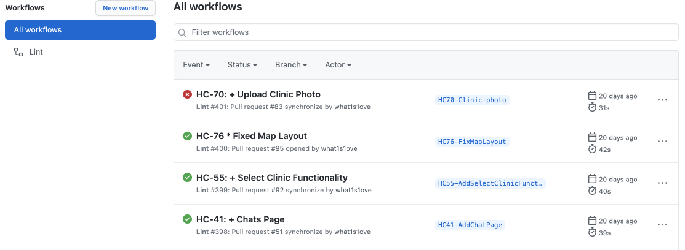
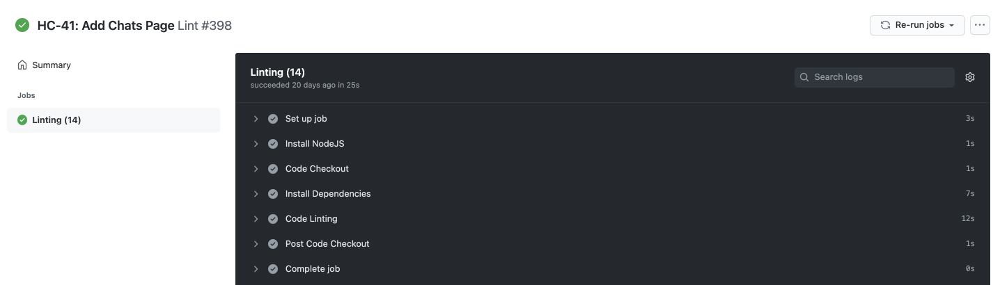
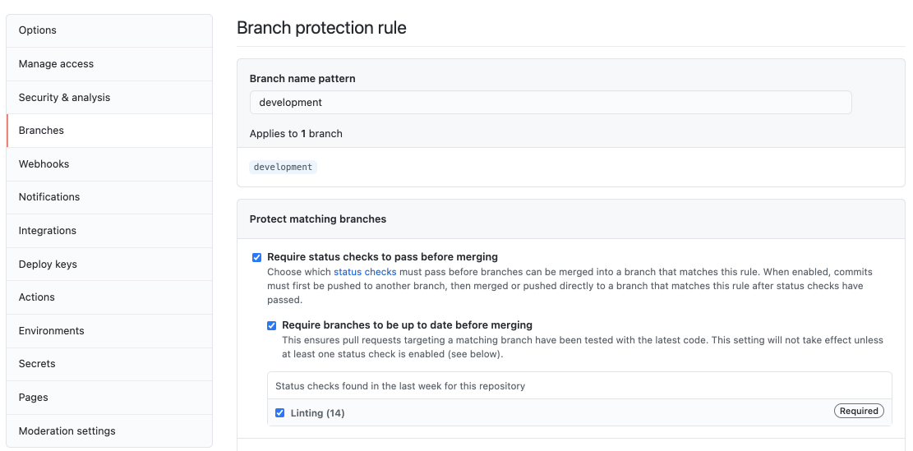
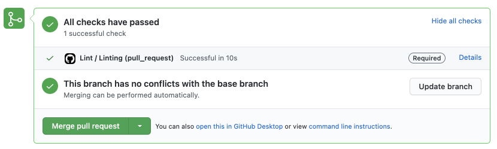

# Github actions: basic concepts with code linting

Program for today:
- Github Actions in general
- Simple project init
- Branch protection
- Bonus. Linting other files
- Conclusions

## Github Actions in general

**`Github Actions`** are commands for github to run some code every time an *event* occurs (Push, Merge, PR and etc.). The code runs on github virtual machines.

What does this code do? Anything. But most importantly, it allows you to automate things necessary for your development process: run tests/lints, deployment, notify people.

Github Actions gives a nice and free CI/CD, and also allows you to create a flexible and easily configurable system for development.

Let's look at a simple example — for each push to one of the environment branches (`development`, `staging`, `production`), linting will be run (example will use `JavaScript`).

Action Example:

```yml
# .github/workflows/lint.yml

name: Lint # name of the action (displayed in the github interface)

on: # event list
  pull_request: # on a pull request to each of these branches
    branches:
      - development
      - staging
      - production

env: # environment variables (available in any part of the action)
  NODE_VERSION: 14

jobs: # list of things to do
  linting:
    name: Linting # job name (unique id)
    runs-on: ubuntu-latest # on which machine to run
    steps: # list of steps
      - name: Install NodeJS
        uses: actions/setup-node@v2
        with:
          node-version: ${{ env.NODE_VERSION }}

      - name: Code Checkout
        uses: actions/checkout@v2

      - name: Install Dependencies
        run: npm ci

      - name: Code Linting
        run: npm run lint
```

### Steps syntax

  - **`name`** — needed to be displayed in the github interface;
  - **`uses`** — specify the name of other action, if we want to use it. You can find many ready-made actions in the [marketplace](https://github.com/marketplace);
  - **`with`** — parameters for custom actions;
  - **`run`** — runs commands in the `shell`. *It is forbidden to use a shell commands with custom actions.*

That's it, we took apart a small but useful example of the github action!

## Simple project init

Let's set up a simple project to see how it works!

```
npm init -y
```

Install [ESLint](https://eslint.org/). ESLint is a tool for identifying and reporting on patterns found in JavaScript code.

```
npm install eslint -DE
```

ESLint [configuration file](https://eslint.org/docs/user-guide/configuring/configuration-files) example:

```yml
# .eslintrc.yml

env:
  es2021: true
  browser: true

extends:
  - eslint:recommended

parserOptions:
  ecmaVersion: 2021
  sourceType: module
```

Also, do not forget to update the scripts section in the `package.json`.

```json
// package.json

{
  "private": true,
  "scripts": {
    "lint:js": "eslint src/**/*.js",
    "lint": "npm run lint:js"
  },
  "dependencies": {},
  "devDependencies": {
    "eslint": "7.24.0"
  }
}
```

In the github interface, the runs will look like this:

<p align="center">
  
  <br>
  <span>Run History</span>
</p>

<p align="center">
  
  <br>
  <span>Inside Each Run</span>
</p>

## Branch protection

To prohibit merging a pull request when linting fails, go to the repository settings and set the merge rules for the branch you want.

<p align="center">
  
</p>

Now in each pull request to the branch we need we will see the result of the action.

<p align="center">
  
</p>

## Linting other files

For now, we only check the format of the `js` files. It is not very good. Attention should be paid not only to `js` files, as there are usually other file formats that developers pay less attention to. Let's fix this and add additional linters to protect our code.

### Style Lint

[Stylelint](https://stylelint.io/) is a mighty, modern linter that helps you avoid errors and enforce conventions in your styles.

```
npm install stylelint stylelint-config-standard -DE
```

Stylelint [configuration file](https://stylelint.io/user-guide/configure) example:

```yml
# .stylelintrc.yml

extends:
  - stylelint-config-standard
```

Updated `package.json`:

```json
// package.json

{
  "private": true,
  "scripts": {
    "lint:css": "stylelint src/**/*.css",
    "lint:js": "eslint src/**/*.js",
    "lint": "npm run lint:css && npm run lint:js"
  },
  "dependencies": {},
  "devDependencies": {
    "eslint": "7.24.0",
    "stylelint": "13.12.0",
    "stylelint-config-standard": "21.0.0"
  }
}
```

### EditorConfig Lint

[EditorConfig](https://editorconfig.org/) helps maintain consistent coding styles for multiple developers working on the same project across various editors and IDEs.

```
npm install editorconfig-checker -DE
```

EditorConfig [configuration file](https://editorconfig.org/#example-file) example:

```
# .editorconfig

root = true

[*]
indent_style = space
indent_size = 2
end_of_line = lf
trim_trailing_whitespace = true
insert_final_newline = true
charset = utf-8
```

Updated `package.json`:

```json
// package.json

{
  "private": true,
  "scripts": {
    "lint:editorconfig": "editorconfig-checker",
    "lint:css": "stylelint src/**/*.css",
    "lint:js": "eslint src/**/*.js",
    "lint": "npm run lint:editorconfig && npm run lint:css && npm run lint:js"
  },
  "dependencies": {},
  "devDependencies": {
    "editorconfig-checker": "4.0.2",
    "eslint": "7.24.0",
    "stylelint": "13.12.0",
    "stylelint-config-standard": "21.0.0"
  }
}
```

### Ls Lint

[Ls-lint](https://ls-lint.org/) —  file and directory name linter. Bring some structure to your project directories.

```
npm install @ls-lint/ls-lint -DE
```

Ls Lint [configuration file](https://ls-lint.org/1.x/configuration/the-basics.html) example:

```yml
# .ls-lint.yml

ls:
  .dir: kebab-case
  .js: kebab-case
  .css: regex:([.a-z]*)([-.][a-z]+)*

ignore:
  - node_modules
  - .git
```

Updated `package.json`:

```json
// package.json

{
  "private": true,
  "scripts": {
    "lint:ls": "ls-lint",
    "lint:editorconfig": "editorconfig-checker",
    "lint:css": "stylelint src/**/*.css",
    "lint:js": "eslint src/**/*.js",
    "lint": "npm run lint:ls && npm run lint:editorconfig && npm run lint:css && npm run lint:js"
  },
  "dependencies": {},
  "devDependencies": {
    "@ls-lint/ls-lint": "1.9.2",
    "editorconfig-checker": "4.0.2",
    "eslint": "7.24.0",
    "stylelint": "13.12.0",
    "stylelint-config-standard": "21.0.0"
  }
}
```

## Conclusions

You know the basics of Github Actions now. I hope this article clarifies the principles of github actions.

This example does not cover all the opportunities. Github has a wonderful [documentation](https://docs.github.com/en/actions/reference/workflow-syntax-for-github-actions), which describes many interesting things!

Linting code is just an example. Everything can be automated.

Some examples:

- Running tests on each pull request;
- Deploying on push to production branch;
- Sending notifications on each pull request/issue, etc.

And many more interesting things 🔥
