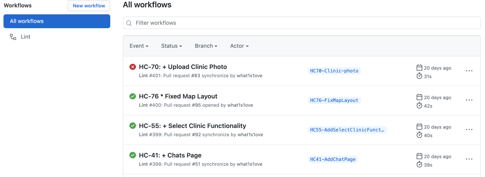
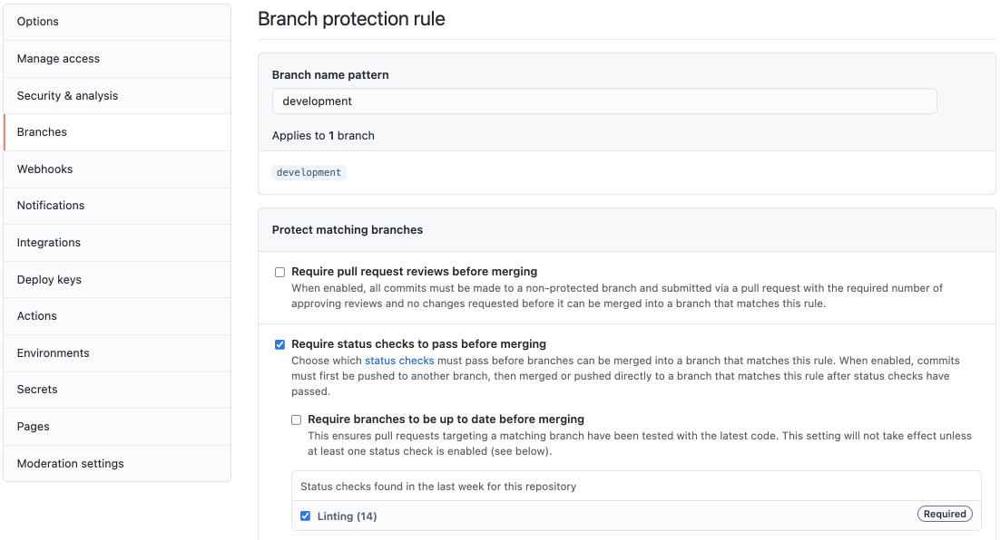
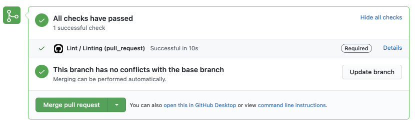
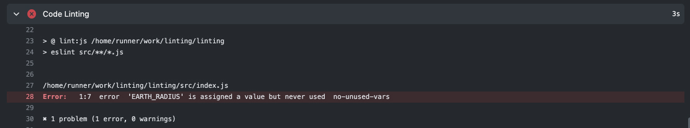
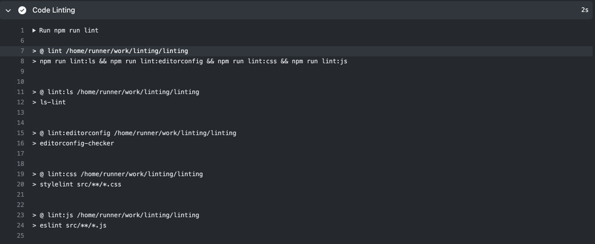

# Github actions: basic concepts with code linting

## Github Actions in general

**`Github Actions`** are commands for github to run some code every time an *event* occurs (Push, Merge, PR and etc.). The code runs on github virtual machines.

What does this code do? Anything. It allows you to automate things necessary for your development process: run tests/lints, deployment, notify people.

Github Actions gives a nice and free CI/CD, and also allows you to create a flexible and easily configurable system for development.

Let's look at the simple example — for each push to one of the environment branches (`development`, `staging`, `production`) we will run linting (example will use `JavaScript`).

Action Example:

```yml
# .github/workflows/lint.yml

name: Lint # name of the action (displayed in the github interface)

on: # event list
  pull_request: # on a pull request to each of these branches
    branches:
      - development
      - staging
      - production

env: # environment variables (available in any part of the action)
  NODE_VERSION: 14

jobs: # list of things to do
  linting:
    name: Linting # job name (unique id)
    runs-on: ubuntu-latest # on which machine to run
    steps: # list of steps
      - name: Install NodeJS
        uses: actions/setup-node@v2
        with:
          node-version: ${{ env.NODE_VERSION }}

      - name: Code Checkout
        uses: actions/checkout@v2

      - name: Install Dependencies
        run: npm ci

      - name: Code Linting
        run: npm run lint
```

### Steps syntax

  - **`name`** — needed to be displayed in the github interface;
  - **`uses`** — specify the name of custom actions if we want to use it. You can find many ready-made actions in the [marketplace](https://github.com/marketplace);
  - **`with`** — parameters for custom actions;
  - **`run`** — runs commands in the `shell`. *It is forbidden to use a shell commands with custom actions.*

That's it, we took apart a small but useful example of the github action!

## Init simple project

Let's set up a simple project to see how it works!

```
npm init -y
```

Install [ESLint](https://eslint.org/). ESLint is a tool for identifying and reporting on patterns found in JavaScript code.

```
npm install eslint -DE
```

ESLint [configuration file](https://eslint.org/docs/user-guide/configuring/configuration-files) example:

```yml
# .eslintrc.yml

env:
  es2021: true
  browser: true

extends:
  - eslint:recommended

parserOptions:
  ecmaVersion: 2021
  sourceType: module
```

Also, do not forget to update the scripts section in the `package.json`.

```json
// scripts in package.json

{
  "scripts": {
    "lint:js": "eslint src/**/*.js",
    "lint": "npm run lint:js"
  }
}
```

In the github interface, the runs will look like this:

<p align="center">
  
  <br>
  <span>Run History</span>
</p>

<p align="center">
  
  <br>
  <span>Inside Each Run</span>
</p>

## Branch protection

To prohibit merging a pull request when linting fails, go to the repository settings and set the merge rules for the branch you want.

To do this we need to check the *Require status checks to pass before merging* checkbox and select the checks we need. In our case, this is *Linting* (the name is taken from the action config).

<p align="center">
  
</p>

Now in each pull request to the branch we need we will see the result of the action. If all is well, the action will be passed:

<p align="center">
  
</p>

But if we broke something the action will be failed:

<p align="center">
  
</p>

Inside each action we can find out what exactly went wrong. For example, here the action tells us that there are unused variables in the code:

<p align="center">
  
</p>

## Linting other files

For now, we only check the format of the `js` files. It is not very good. Attention should be paid not only to `js` files, as there are usually other file formats that developers pay less attention to. Let's fix this and add additional linters to protect our code.

### Style Lint

[Stylelint](https://stylelint.io/) is a mighty, modern linter that helps you avoid errors and enforce conventions in your styles.

I use a simple example in which I just extend the config from the recommended. But even with this couple of lines we will protect our styles.

Stylelint supports a huge number of configuration options. Be sure to check the [documentation](https://stylelint.io/user-guide/configure) to find the rules that fit your project.

```
npm install stylelint stylelint-config-standard -DE
```

Stylelint [configuration file](https://stylelint.io/user-guide/configure) example:

```yml
# .stylelintrc.yml

extends:
  - stylelint-config-standard
```

Updated `package.json`:

```json
// scripts in package.json

{
  "scripts": {
    "lint:css": "stylelint src/**/*.css",
    "lint:js": "eslint src/**/*.js",
    "lint": "npm run lint:css && npm run lint:js"
  }
}
```

### EditorConfig Lint

[EditorConfig](https://editorconfig.org/) helps maintain consistent coding styles for multiple developers working on the same project across various editors and IDEs.

```
npm install editorconfig-checker -DE
```

EditorConfig [configuration file](https://editorconfig.org/#example-file) example:

```
# .editorconfig

root = true

[*]
indent_style = space
indent_size = 2
end_of_line = lf
trim_trailing_whitespace = true
insert_final_newline = true
charset = utf-8
```

Updated `package.json`:

```json
// scripts in package.json

{
  "scripts": {
    "lint:editorconfig": "editorconfig-checker",
    "lint:css": "stylelint src/**/*.css",
    "lint:js": "eslint src/**/*.js",
    "lint": "npm run lint:editorconfig && npm run lint:css && npm run lint:js"
  }
}
```

### Ls Lint

[Ls-lint](https://ls-lint.org/) —  file and directory name linter. Bring some structure to your project directories.

```
npm install @ls-lint/ls-lint -DE
```

Ls Lint [configuration file](https://ls-lint.org/1.x/configuration/the-basics.html) example:

```yml
# .ls-lint.yml

ls:
  .dir: kebab-case
  .js: kebab-case
  .css: regex:([.a-z]*)([-.][a-z]+)*

ignore:
  - node_modules
  - .git
```

Updated `package.json`:

```json
// scripts in package.json

{
  "scripts": {
    "lint:ls": "ls-lint",
    "lint:editorconfig": "editorconfig-checker",
    "lint:css": "stylelint src/**/*.css",
    "lint:js": "eslint src/**/*.js",
    "lint": "npm run lint:ls && npm run lint:editorconfig && npm run lint:css && npm run lint:js"
  }
}
```

Now **4** linters will run for each pull request. Hope you and your team will follow and improve the linters configs. And you will always see the linter result without errors:

<p align="center">
  
</p>

## Pricing

Github actions are not free. Now the free plan gives ~2000 minutes. Usually this is enough for small and medium projects.

You can always find up-to-date information on the use-plan [here](https://github.com/pricing).

## Conclusions

You know the basics of Github Actions now. I hope this article clarifies the principles of github actions.

This example does not cover all the opportunities. Github has a wonderful [documentation](https://docs.github.com/en/actions/reference/workflow-syntax-for-github-actions), which describes many interesting things!

Linting code is just an example. Everything can be automated.

Some examples:

- Running tests on each pull request;
- Deploying on push to production branch;
- [Prettify](https://prettier.io/) your code before merging;
- Publishing packages;
- Sending notifications on each pull request/issue, etc.

And many more interesting things 🔥
